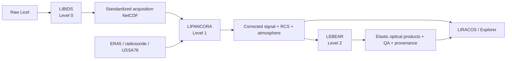

# MILGRAU 🌩️

**Multi-Indexed LALINET GeneRAlized and Unified algorithm**

MILGRAU is a Python processing suite for atmospheric elastic/Raman lidar data, developed around the long-term SPU-Lidar record operated by IPEN/USP in São Paulo, Brazil. It converts raw Licel acquisitions into traceable Level 0, Level 1 and elastic Level 2 scientific products while keeping instrument history, atmospheric state, retrieval assumptions, uncertainty semantics and provenance visible.

The current development baseline is the `new-architecture` branch. Architecture cleanup is no longer the main roadmap task: the project is now hardening the productive scientific baseline, FAIR provenance and validation before starting the high-column Level 2 redesign.

> A successful command means that the processing stage completed. It does not by itself certify every scientific diagnostic. Product variables, flags, support semantics, provenance and validation evidence define the scientific interpretation.

## Processing path



| Stage | Command | Main product |
| --- | --- | --- |
| Level 0 | `milgrau-libids` | standardized raw acquisition NetCDF |
| Level 1 | `milgrau-lipancora` | corrected signal/RCS, uncertainty and canonical atmosphere |
| Visualization | `milgrau-liracos` | Level 1 quicklooks |
| Level 2 | `milgrau-lebear` | selected/glued signal, molecular fields and elastic aerosol optical products |
| Explorer | `milgrau-explorer` | interactive product inspection |

See [`docs/processing_levels.md`](docs/processing_levels.md) for the stable contract of each stage.

## Current Level 2 scientific baseline

The productive Level 2 path is explicitly **backward elastic Klett–Fernald–Sasano** retrieval for configured elastic wavelengths. Current method hardening includes:

- one common support mask for signal means and their reported uncertainties;
- missing signal uncertainty is unsupported, never silently converted to zero Monte Carlo noise;
- molecular calculations use the complete pressure/temperature atmosphere materialized at Level 1;
- Rayleigh reference diagnostics and productive backward KFS acceptance are explicit;
- aggregate optical uncertainty does not treat mixed lidar-ratio/reference nuisance terms as independent noise;
- elastic extinction is conditional on the assumed aerosol lidar ratio;
- unsupported optical bins remain `NaN` and are not filled merely to extend vertical coverage.

The exact schema/method identity and uncertainty policy are documented in [`docs/level2_schema.md`](docs/level2_schema.md). The mapping from scientific claims to code, tests, product metadata and primary literature is in [`docs/scientific_traceability.md`](docs/scientific_traceability.md).

## Installation

MILGRAU requires **Python 3.12 or newer**.

```bash
git clone https://github.com/spulidar/milgrau.git
cd milgrau
git checkout new-architecture
python -m venv .venv
```

Activate the environment and install the package:

```bash
pip install .
```

For editable development/testing:

```bash
pip install -e ".[dev]"
```

Optional extras:

```bash
# ERA5 through the Copernicus Climate Data Store
pip install -e ".[era5]"

# Interactive Streamlit explorer
pip install -e ".[explorer]"

# Complete local development environment
pip install -e ".[dev,era5,explorer]"
```

ERA5 credentials are not stored in MILGRAU YAML or NetCDF provenance; use the normal provider-supported `cdsapi` credential mechanism.

## Quick start

With `config.yaml` and `station.yaml` resolved for the project:

```bash
milgrau-libids
milgrau-lipancora
milgrau-liracos
milgrau-lebear
```

The primary CLIs accept repeatable input selectors and `--force`, for example:

```bash
milgrau-libids --input 2025050903z --force
milgrau-lipancora --input 20250509sa03z --force
milgrau-lebear --input 20250509sa03z --force
```

LEBEAR can also process a restricted UTC interval without changing the original Level 1 product:

```bash
milgrau-lebear --input 20250509sa03z --time-window 04:00 05:00
```

Shell status is deliberately operational. Scientific QA belongs in the NetCDF diagnostics rather than being compressed into an exit code.

## Configuration ownership

MILGRAU keeps three responsibilities separate:

- **`config.yaml`** — processing/scientific recipe: how the run should be processed;
- **`station.yaml`** — observational reality: station/instrument history, calibration identity and station-derived information;
- **Python** — equations, physical constants, validation contracts and implementation mechanics.

The exact ownership boundary and hash/provenance policy are documented in [`docs/configuration_ownership.md`](docs/configuration_ownership.md). The canonical code-owner inventory is in [`docs/code_inventory.md`](docs/code_inventory.md).

Published NetCDF provenance embeds the exact processing/station YAML snapshots. Level 2 also identifies exact upstream Level 1 bytes and the installed MILGRAU Python source content, so scientific input/code states can be distinguished without relying on machine-local paths.

## Documentation map

- [`docs/processing_levels.md`](docs/processing_levels.md) — stable Level 0/1/2 responsibilities and boundaries.
- [`docs/configuration_ownership.md`](docs/configuration_ownership.md) — `config.yaml` vs `station.yaml` vs Python ownership.
- [`docs/code_inventory.md`](docs/code_inventory.md) — canonical module/API ownership.
- [`docs/atmospheric_profiles.md`](docs/atmospheric_profiles.md) — radiosonde/ERA5/USSA76 atmosphere handling.
- [`docs/level2_schema.md`](docs/level2_schema.md) — current Level 2 NetCDF schema, support, uncertainty and provenance semantics.
- [`docs/scientific_traceability.md`](docs/scientific_traceability.md) — scientific traceability matrix and verified bibliography.
- [`tracker.md`](tracker.md) — scientific engineering roadmap and acceptance gates.

## Development checks

The CI baseline runs Ruff plus the full pytest suite on Ubuntu and Windows with Python 3.12 and 3.14.

```bash
ruff check .
pytest
```

Synthetic/analytical cases provide the main known-truth evidence for numerical science. Real observations are regression/behavior evidence; external LPP/SCC/ELDA comparisons are interoperability/methodology evidence rather than automatic numerical ground truth.

## Current validation boundaries

The roadmap deliberately keeps several instrument-dependent topics evidence-first:

- physical photon-counting saturation under SPU operating conditions;
- dark-current subtraction versus nonlinear dead-time correction ordering;
- hard propagated-error SNR gates;
- productive cloud/layer vetoes for Rayleigh references;
- materiality of fitted gluing slope/intercept uncertainty;
- future high-column reference catalogue, backbone, ensemble and optional cascade.

No invented threshold or extrapolation is accepted as a way to close these items. A target upper altitude is a validation target, not permission to fill unsupported data.

## Citation

If you use MILGRAU, cite the software using [`CITATION.cff`](CITATION.cff). The current citation metadata identifies MILGRAU version `2026.9` and Zenodo DOI `10.5281/zenodo.20330638`.

Release/version/DOI alignment is checked again at the publication-readiness gate because the development branch can advance after a CalVer release.

## License status

An explicit root software license is still a release blocker in [`tracker.md`](tracker.md). Do not infer the software license from image assets or unrelated Creative Commons artwork until the project/institution license decision is recorded explicitly.
