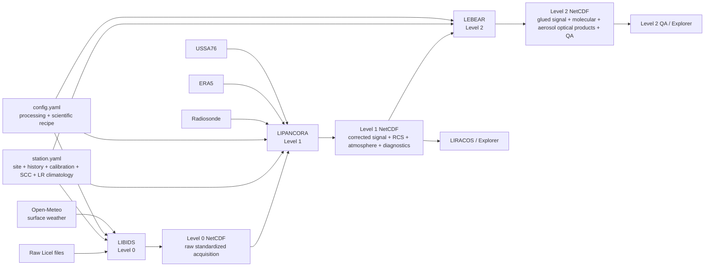

# MILGRAU 🌩️

**Multi-Indexed LALINET GeneRAlized and Unified algorithm**

MILGRAU is a Python processing suite for atmospheric elastic/Raman lidar data, developed around the long-term **SPU-Lidar** record operated by **IPEN/USP in São Paulo, Brazil**. Its purpose is to turn raw Licel acquisitions into traceable scientific products while keeping the measurement history, instrumental calibration, atmospheric state, retrieval assumptions, and data-quality decisions visible in the output.

This README documents the current `new-architecture` processing contract for MILGRAU `2026.9`. It is intended first as a **scientific and data-product guide**: what enters each processing level, what physical operations are performed, what comes out in the NetCDF files, which assumptions are productive today, and which parts remain provisional or under validation.

MILGRAU currently provides a complete operational path from raw Licel files to Level 0, Level 1 and elastic Level 2 products. Level 2 is no longer a planned placeholder: the productive retrieval performs block-wise signal selection/gluing, molecular calculation, automatic Rayleigh-reference selection, and high-reference **backward Klett–Fernald** aerosol retrieval for the configured elastic wavelengths.

> **Scientific interpretation matters.** A successful command means that processing completed; it does not by itself mean that every scientific diagnostic is valid. MILGRAU therefore writes explicit correction, source-selection, Rayleigh, KFS, completeness, and provenance information into the products.

---

## Contents

- [Processing overview](#processing-overview)
- [Installation](#installation)
- [Quick start](#quick-start)
- [Configuration model: `config.yaml` and `station.yaml`](#configuration-model-configyaml-and-stationyaml)
- [Measurement IDs, directories and output names](#measurement-ids-directories-and-output-names)
- [Level 0 — LIBIDS](#level-0--libids)
- [Level 1 — LIPANCORA](#level-1--lipancora)
- [Atmospheric profiles, PBL and tropopause](#atmospheric-profiles-pbl-and-tropopause)
- [Level 2 — LEBEAR](#level-2--lebear)
- [Visualization — LIRACOS and Level 2 QA](#visualization--liracos-and-level-2-qa)
- [FAIR provenance and reproducibility](#fair-provenance-and-reproducibility)
- [Known scientific limitations and active validation topics](#known-scientific-limitations-and-active-validation-topics)
- [Citation](#citation)

---

# Processing overview

MILGRAU separates the measurement record from the processing recipe:

- **raw Licel files** contain the acquisition itself;
- **`station.yaml`** describes observational reality: station/site metadata, historical instrument periods, channel calibration, SCC mapping and station-derived lidar-ratio climatology;
- **`config.yaml`** describes the scientific/processing recipe to apply;
- external meteorological sources provide ancillary atmospheric state when requested;
- every published NetCDF embeds the exact processing and station YAML used to generate it.



The principal pipeline stages are:

| Stage | Command | Main input | Main scientific output |
|---|---|---|---|
| Level 0 | `milgrau-libids` | raw Licel acquisition + dark current | standardized acquisition NetCDF, optionally SCC-ready |
| Level 1 | `milgrau-lipancora` | Level 0 NetCDF | corrected signal, RCS, uncertainties, PBL, canonical atmosphere, CPT/LRT |
| Visualization | `milgrau-liracos` | Level 1 NetCDF | Level 1 quicklooks and mean-profile figures |
| Level 2 | `milgrau-lebear` | Level 1 NetCDF | analog/PC-selected signal, molecular profiles, Rayleigh diagnostics, aerosol backscatter/extinction |
| Explorer | `milgrau-explorer` | processed products | interactive inspection with Streamlit |

---

# Installation

## Requirements

MILGRAU requires **Python 3.12 or newer**. The core installation includes NumPy, pandas, xarray, netCDF4, SciPy, Numba, Matplotlib, Siphon, Tenacity and PyYAML.

Clone the repository and create a virtual environment:

```bash
git clone https://github.com/spulidar/milgrau.git
cd milgrau
git checkout new-architecture

python -m venv .venv
```

Activate it on Linux/macOS:

```bash
source .venv/bin/activate
```

or in PowerShell on Windows:

```powershell
.\.venv\Scripts\Activate.ps1
```

Install the core package:

```bash
pip install .
```

For editable scientific/development work:

```bash
pip install -e ".[dev]"
```

## ERA5 support

ERA5 retrieval is optional and requires `cdsapi>=0.7.7`:

```bash
pip install -e ".[era5]"
```

MILGRAU deliberately does **not** store Copernicus credentials in `config.yaml`, `station.yaml`, or NetCDF provenance. Configure the CDS token through the normal `cdsapi` user configuration (`~/.cdsapirc` or the supported environment mechanism). ERA5 requests are explicitly sent to the **Climate Data Store** endpoint rather than inheriting an unrelated ADS endpoint from the machine.

## Interactive explorer

```bash
pip install -e ".[explorer]"
milgrau-explorer
```

For a complete local scientific-development environment:

```bash
pip install -e ".[dev,era5,explorer]"
```

---

# Quick start

With `config.yaml` and `station.yaml` at the project root and raw data under the configured raw-data directory:

```bash
# Raw Licel -> Level 0
milgrau-libids

# Level 0 -> Level 1
milgrau-lipancora

# Level 1 quicklooks
milgrau-liracos

# Level 1 -> Level 2
milgrau-lebear
```

The primary CLIs accept repeatable `--input` selectors and `--force`:

```bash
milgrau-libids --input 20250509nt --force
milgrau-lipancora --input 20250509sant --force
milgrau-liracos --input 20250509sant --force
milgrau-lebear --input 20250509sant --force
```

LEBEAR can process a restricted UTC time interval without modifying the original Level 1 product:

```bash
milgrau-lebear --input 20250509sant --time-window 04:00 05:00
```

Shell exit codes are intentionally simple: `0` means normal completion or intentional skipping, `1` means one or more processing errors, and `2` means the command could not run structurally. Scientific QA is represented in the NetCDF diagnostics rather than encoded into the shell status.

---

# Configuration model: `config.yaml` and `station.yaml`

The distinction between the two YAML files is fundamental to MILGRAU scientific provenance.

| File | Scientific role | Examples |
|---|---|---|
| `config.yaml` | **processing recipe** — choices that define how data are processed | background interval, PBL method settings, atmosphere priority, Rayleigh search, Monte Carlo size, gluing QA thresholds |
| `station.yaml` | **observational reality** — facts that describe where/how the data were acquired and station-derived information | coordinates, altitude, timezone, historical laser periods, dead time, bin shift, SCC IDs, lidar-ratio climatology |

A processing setting should not silently become an instrument fact, and an instrument fact should not be duplicated into the generic processing recipe. This distinction is also preserved in each output through embedded copies of both YAML files.

## `config.yaml`: current scientific recipe

### Project, directories and processing

| Path | Current repository value | Meaning |
|---|---:|---|
| `station_config` | `station.yaml` | station catalog used with the processing recipe |
| `processing.incremental` | `true` | reuse only current products with valid structure and current readable provenance |
| `processing.console_level` | `INFO` | concise operator output |
| `processing.file_level` | `DEBUG` | detailed audit log |
| `directories.raw_data` | `01-data` | raw Licel root |
| `directories.processed_data` | `02-processed_data` | Level 0/1/2 product root |
| `directories.log_dir` | `logs` | audit-log root |

Historical cache-directory names and configured non-Licel extensions are excluded from raw acquisition discovery. Files identified as spurious are handled through the configured quarantine policy rather than interpreted as lidar measurements.

### Level 0 recipe

| Path | Current value | Scientific/operational meaning |
|---|---:|---|
| `level0.acquisition_qa.laser_shot_tolerance_fraction` | `0.002` | allowed fractional deviation from the modal shot count |
| `level0.acquisition_qa.licel_header_time_jitter_s` | `1.0 s` | tolerated header-duration jitter around the duration implied by shots/frequency |
| `level0.dark_current.max_association_hours` | `12 h` | maximum time separation for reassignment of an orphan dark-current group |
| `level0.surface_weather.missing_policy` | `nan` | missing weather remains missing rather than being invented |
| `surface_weather.cache_dir` | `.cache/weather` | disposable Open-Meteo cache |

### Level 1 recipe

| Path | Current value | Meaning |
|---|---:|---|
| `level1.background.start_altitude_m` | `29000 m` | lower background interval bound |
| `level1.background.stop_altitude_m` | `29999 m` | upper background interval bound |
| `level1.photon_counting.deadtime_min_denominator` | `0.05` | numerical floor for the non-paralyzable dead-time denominator |
| `level1.pbl.reference_channel` | `532.AN` | only channel used by the productive PBL diagnostic |
| `level1.pbl.min_search_altitude_m` | `500 m` | PBL search lower bound |
| `level1.pbl.max_search_altitude_m` | `4000 m` | PBL search upper bound |
| `level1.pbl.smooth_bins` | `15` | smoothing width before gradient calculation |
| `level1.atmosphere.source_priority` | `radiosonde, era5, ussa76` | ordered thermodynamic-source policy |
| `level1.atmosphere.external_profile_outside_coverage` | `ussa76` | fills only source-profile altitude gaps outside its coverage |

The current radiosonde policy uses the nearest configured 00 or 12 UTC sounding within 6 h. ERA5 uses an explicit 37-pressure-level request from 1000 to 1 hPa on a 0.25° grid, with a 0.25° request half-width around the station.

`level1.missing_channel_calibration.policy: neutral_with_warning` exists for historical data whose traceable calibration is no longer available. When this explicit legacy policy is invoked, the event is written per channel and counted in the Level 1 product; it is not presented as a measured calibration.

### Level 2 recipe

| Path | Current value | Meaning |
|---|---:|---|
| `inversion.wavelengths_to_process` | `[355, 532] nm` | requested elastic retrieval wavelengths |
| `inversion.block_average_minutes` | `20 min` | temporal block size for optical retrieval |
| `inversion.kfs_mode` | `backward` | productive high-reference Klett–Fernald direction |
| `inversion.monte_carlo_iterations` | `300` | partial uncertainty ensemble size |
| `inversion.random_seed` | `143` | reproducible MC seed |
| `inversion.beta_ref_relative_std` | `0.10` | relative perturbation of total backscatter at the boundary |
| `inversion.aerosol_ref_fraction` | `0.0` | pure-molecular boundary, equivalent to scattering ratio `R_ref = 1` |
| `inversion.min_lidar_ratio_sr` | `10 sr` | lower bound applied to sampled aerosol lidar ratio |
| `inversion.allow_negative_aerosol` | `false` | productive retrieval does not retain negative aerosol backscatter |
| `inversion.molecular_fit.ref_alt_min_m` | `5000 m` | Rayleigh-reference search lower bound |
| `inversion.molecular_fit.ref_alt_max_m` | `25000 m` | Rayleigh-reference search upper bound |
| `inversion.molecular_fit.ref_window_m` | `1000 m` | physical Rayleigh-window width |
| `inversion.molecular_fit.max_relative_slope` | `0.25` | Rayleigh ratio-shape acceptance limit |
| `inversion.molecular_fit.max_relative_variance` | `0.50` | normalized Rayleigh ratio-variance limit |
| `inversion.molecular_fit.min_valid_fraction` | `0.50` | minimum valid fraction inside reference window |

The 1 km Rayleigh width is converted to bins on the actual uniform Level 1 altitude grid. On the current 7.5 m SPU common grid it resolves to 133 bins; a different vertical resolution retains approximately the same **physical** width rather than inheriting 133 as a scientific constant.

The gluing recipe controls the analog/photon-counting overlap search. The current search is restricted to indices 150–1200 with a 120-bin window, correlation threshold 0.95, intercept threshold 5%, relative RMSE 0.08, relative bias 0.05, minimum valid fraction 0.80 and explicit saturation-related limits. The search domain is not silently expanded if it cannot support the configured window.

Cloud screening is currently configured as:

```yaml
inversion:
  cloud_screening:
    enabled: false
```

A preliminary layer detector exists, but it is deliberately not a productive Rayleigh-reference gate until it has been validated against SPU observations.

## `station.yaml`: station history and instrument truth

`station.yaml` is a temporal station catalog. The measurement date selects the historical profile whose validity interval contains the acquisition. That profile then determines the station altitude/instrument period, calibration identity and, where available, the applicable SCC configuration.

The station section contains the SPU identifier/name/institution, `America/Sao_Paulo` timezone, site coordinates, radiosonde station identity and lidar pointing geometry. The current catalog also preserves historical station-altitude changes instead of forcing every acquisition to use one modern value.

### Historical station profiles

| Profile | Validity | Main instrument context | SCC context |
|---|---|---|---|
| `spu-legacy` | 2000-01-01 — 2017-03-07 | historical record | no SCC mapping in the current catalog |
| `spu-apel-2017` | 2017-03-08 — 2018-03-18 | Quantel Brillant B, 10 Hz | day 248 / night 294 |
| `spu-raman-2018` | 2018-03-19 — 2024-09-09 | Quantel Brillant, 10 Hz | day 565 / night 484 |
| `spu-merionc-2024` | from 2024-09-10 | Quantel MerionC, 100 Hz | day 1047 / night 1046 |

The resolved profile ID and calibration ID are propagated through the data products so a file can be interpreted in the context of the station era that generated it.

### Channel calibration

Calibration entries are keyed by canonical channel names such as `355.PC`, `532.AN` and `532.PC`. Each channel records the fields relevant to Level 1 correction:

```yaml
channels:
  532.PC:
    detector_mode: photon_counting
    deadtime_us: 0.0035
    bin_shift_bins: -3
    background_offset: 0.0
    saturation:
      status: not_characterized
```

For photon-counting channels, `saturation.status` is scientifically important. The present SPU catalog explicitly says `not_characterized`; MILGRAU therefore does **not** pretend to know a physical detector saturation rate.

### Station lidar-ratio climatology

The monthly aerosol lidar ratios and their wavelength-specific standard deviations are station-derived metadata and therefore live in `station.yaml`, not in the generic processing recipe. At load time they are materialized into the Level 2 retrieval view for the requested wavelength/month, while the station catalog remains the authoritative source.

This means the current elastic extinction product is conditional on the SPU monthly lidar-ratio climatology; it is not a Raman extinction retrieval.

### SCC mapping

Historical profiles may contain day/night SCC configuration IDs and channel IDs. If a measurement has a complete applicable mapping, LIBIDS can emit an SCC-ready Level 0 product. Missing historical SCC mapping does not require MILGRAU to invent channel IDs: the ordinary Level 0 product can remain scientifically usable while SCC readiness is reported separately.

---

# Measurement IDs, directories and output names

Raw files are grouped using station-local time. The current period classification is:

| Local time | Period |
|---|---|
| 06:00–11:59 | `am` |
| 12:00–17:59 | `pm` |
| 18:00–05:59 | `nt` |

A measurement ID such as `20250509nt` becomes the canonical save ID `20250509sant`.

Processed products use the hierarchy:

```text
02-processed_data/
└── YYYY/
    └── MM/
        └── YYYYMMDDsa<period>/
            ├── YYYYMMDDsa<period>.nc
            ├── YYYYMMDDsa<period>_scc.nc          # when SCC-ready/exported
            ├── YYYYMMDDsa<period>_level1_rcs.nc
            ├── YYYYMMDDsa<period>_level2_optical.nc
            ├── quicklooks/...
            └── level2_qa/...
```

A LEBEAR `--time-window` run adds a time-window tag before `_level2_optical.nc` so the subset product is distinguishable from the full-measurement retrieval.

---

# Level 0 — LIBIDS

Level 0 represents the acquisition after file discovery, measurement grouping and acquisition-level quality checks, but **before** the Level 1 instrumental signal corrections.

## Inputs and grouping

LIBIDS reads Licel headers and binary profiles, converts acquisition timestamps to the station timezone for measurement grouping, and retains UTC timing in the exported product.

Measurement and dark-current records are screened separately using the configured laser-shot and duration rules. An orphan dark-current group may be associated with the nearest measurement only when its separation does not exceed the configured 12 h limit. The association method and maximum time separation are written to the product provenance.

Native Licel acquisition information is authoritative where available. In particular:

- channel range resolution must come from a positive finite Licel `BinW` value;
- analog acquisition scale/DAQ range must be present and positive;
- laser shots must be positive and conformable with time/channel dimensions;
- MILGRAU does not invent a generic 7.5 m resolution, fake SCC channel ID or ADC range when those data are absent.

Surface weather is obtained from the Open-Meteo historical archive using station coordinates. With the current `missing_policy: nan`, failure to retrieve weather keeps those fields missing rather than substituting an artificial temperature/pressure pair.

## Level 0 dimensions

| Dimension | Meaning |
|---|---|
| `time` | accepted measurement profiles |
| `channels` | native lidar channels |
| `points` | native range-bin index |
| `nb_of_time_scales` | SCC-compatible time-scale dimension, currently length 1 |
| `scan_angles` | pointing-angle table, currently length 1 |
| `time_bck` | dark-current profiles, present when dark-current data are written |

## Level 0 variable reference

| Variable | Dimensions | Units / flags | Interpretation |
|---|---|---|---|
| `Raw_Data_Start_Time` | `time, nb_of_time_scales` | s | profile start offsets from the product reference time |
| `Raw_Data_Stop_Time` | `time, nb_of_time_scales` | s | profile stop offsets |
| `Raw_Lidar_Data` | `time, channels, points` | PC counts / analog native acquisition units | standardized raw signal tensor |
| `Laser_Pointing_Angle` | `scan_angles` | degree | station pointing angle from zenith |
| `Laser_Pointing_Angle_of_Profiles` | `time, nb_of_time_scales` | angle-table index | pointing-angle assignment per profile |
| `Laser_Shots` | `time, channels` | shots | actual laser-shot count used for each profile/channel |
| `Molecular_Calc` | scalar | SCC field | currently 0; molecular atmosphere is not calculated at Level 0 |
| `Pressure_at_Lidar_Station` | scalar | hPa | surface pressure ancillary value |
| `Temperature_at_Lidar_Station` | scalar | °C | surface temperature ancillary value |
| `Raw_Data_Range_Resolution` | `channels` | m | native channel range resolution from Licel metadata |
| `Background_Low` | `channels` | m | configured Level 1 background lower bound exported for SCC context |
| `Background_High` | `channels` | m | configured Level 1 background upper bound |
| `id_timescale` | `channels` | index | SCC-compatible time-scale assignment |
| `channel_string` | `channels` | text | canonical MILGRAU channel name |
| `channel_ID` | `channels` | SCC ID | present only when a complete SCC mapping is available |
| `DAQ_Range` | `channels` | mV | analog acquisition scale; written when analog channels are present |
| `LR_Input` | `channels` | `0=external_profile`, `1=fixed_scc_db_value` | SCC lidar-ratio input policy where applicable |
| `Background_Profile_Available` | `channels` | `0/1` | whether a usable dark-current profile exists for each channel |
| `Background_Profile` | `time_bck, channels, points` | channel-native units | dark-current profiles, when available |
| `Raw_Bck_Start_Time` | `time_bck, nb_of_time_scales` | s | dark-current start offsets |
| `Raw_Bck_Stop_Time` | `time_bck, nb_of_time_scales` | s | dark-current stop offsets |

Important Level 0 global attributes include `Measurement_ID`, station/system identity, station coordinates, resolved `Station_Profile`, `SCC_Ready`, source-file list/count, acquisition start/stop, surface-weather values and dark-current association provenance. SCC configuration ID/name are recorded when the product is SCC-ready.

---

# Level 1 — LIPANCORA

Level 1 converts the standardized acquisition into instrumentally corrected lidar signals on one common altitude grid, propagates one-sigma uncertainty through the implemented corrections, and materializes the thermodynamic atmosphere required for molecular processing.

## Altitude grid

Each channel is corrected on its **native** range grid first. The Level 1 common coordinate is then defined using the finest native range resolution present in the Level 0 product:

```text
altitude[i] = (i + 0.5) × min(native channel range resolutions)
```

The coordinate is therefore a range-bin-center grid above the station (AGL). Channels with coarser native grids are interpolated to this common grid only **after** their native-grid corrections have been evaluated.

## Instrumental correction sequence

The productive correction path is:

1. use dark-current profile when available;
2. for photon-counting channels, convert accumulated counts to MHz using per-profile `Laser_Shots` and bin time;
3. calculate PC shot-noise uncertainty from the **observed raw counts before dark-current subtraction**;
4. combine independent dark-current uncertainty in quadrature when available;
5. apply non-paralyzable dead-time correction;
6. apply channel bin shift, marking newly introduced edge bins as `NaN`;
7. estimate the configured high-altitude background after shift and subtract it, including the configured channel background offset;
8. propagate the background-mean uncertainty;
9. write corrected signal and one-sigma uncertainty;
10. compute range-corrected signal, `RCS(z) = corrected_signal(z) × z²`, and propagate its uncertainty.

For a photon-counting rate `r` and dead time `τ`, the implemented non-paralyzable correction uses the denominator

```text
1 - r τ
```

with a configured numerical lower bound of 0.05. **Numerical clipping of this denominator is not the same thing as physical detector saturation.** The two concepts have separate diagnostics.

## Physical PC saturation

`pc_saturation_mask` is only a physical saturation flag when a traceable detector `max_rate_mhz` has been characterized in `station.yaml`. With the current SPU calibration catalog, PC saturation is explicitly `not_characterized`; therefore:

> `pc_saturation_mask == 0` must not be interpreted as proof that the detector was below a known physical saturation limit when `pc_saturation_characterized == 0`.

## Level 1 signal and correction variables

| Variable | Dimensions | Meaning |
|---|---|---|
| `corrected_signal` | `time, channel, altitude` | corrected lidar signal before multiplication by range² |
| `corrected_signal_error` | `time, channel, altitude` | propagated one-sigma uncertainty of corrected signal |
| `range_corrected_signal` | `time, channel, altitude` | corrected signal × range² |
| `range_corrected_signal_error` | `time, channel, altitude` | propagated one-sigma RCS uncertainty |
| `pc_saturation_mask` | `time, channel, altitude` | physical PC saturation flag only when characterization exists |
| `channel_correction_success` | `channel` | whether the channel completed Level 1 correction |
| `dark_current_used` | `channel` | whether a Level 0 dark-current profile was applied |
| `deadtime_correction_applied` | `channel` | whether PC dead-time correction was active |
| `calibration_assumed_neutral` | `channel` | explicit historical neutral-calibration policy was used |
| `deadtime_min_denominator_observed` | `channel` | smallest observed non-paralyzable denominator |
| `deadtime_min_denominator_allowed` | `channel` | configured numerical denominator floor |
| `pc_saturation_characterized` | `channel` | physical detector limit known (`1`) or unknown (`0`) |
| `pc_saturation_rate_limit_mhz` | `channel` | characterized physical rate limit; `NaN` if unknown/not applicable |
| `bin_shift_bins` | `channel` | applied channel alignment shift |
| `deadtime_clipping_fraction` | `time, channel` | fraction of bins numerically clipped by denominator floor |
| `pc_saturation_fraction` | `time, channel` | fraction of bins physically flagged saturated where characterized |
| `bin_shift_invalid_fraction` | `time, channel` | fraction of bins made invalid by shift alignment |

The signal units remain detector-dependent before range correction (`channel native corrected units`). RCS is written as `a.u. m²` because absolute instrumental calibration is not being claimed by this level.

---

# Atmospheric profiles, PBL and tropopause

These diagnostics belong to Level 1 because Level 2 must consume a fully resolved atmospheric state rather than independently choosing a meteorological source.

## PBL height

The current PBL diagnostic uses **532.AN only**. It searches 0.5–4.0 km after a 15-bin moving-average smoothing step and selects the strongest negative gradient of RCS. Edge padding is used before convolution to avoid artificial boundary gradients.

The result is stored as:

```text
PBL_Height_km(time)
```

The method does not silently substitute another channel if 532.AN is absent or its Level 1 correction failed. A profile with no valid negative-gradient result remains unavailable rather than being assigned an artificial boundary-layer height.

## Canonical thermodynamic atmosphere

Every valid current Level 1 product contains:

```text
Atmospheric_Temperature_K(altitude)
Atmospheric_Pressure_hPa(altitude)
```

The source policy is currently:

```text
radiosonde → ERA5 → US Standard Atmosphere 1976
```

Level 2 reads these variables directly. It does **not** perform radiosonde/ERA5 network access, select a new source, or apply a hidden atmospheric fallback.

### Radiosonde

The preferred external source is the University of Wyoming upper-air archive accessed through Siphon. The station identity comes from `station.yaml`. MILGRAU selects the nearest configured 00/12 UTC sounding within 6 h of the measurement midpoint and records the target time and time separation. Retrieved profiles are cached as CSV with a JSON metadata sidecar.

### ERA5

If no usable radiosonde is available, the current recipe requests ERA5 pressure-level reanalysis from the Copernicus Climate Data Store. MILGRAU requests only the fields required for the thermodynamic profile:

```text
temperature
geopotential
```

The current recipe explicitly requests 37 pressure levels from 1000 to 1 hPa. ERA5 geopotential is converted to geopotential height and then geometric altitude. The profile is standardized to height, temperature and pressure and the nearest hourly ERA5 analysis is associated with the measurement.

ERA5 source provenance includes DOI **10.24381/cds.bd0915c6**.

### Mapping an external profile to the lidar grid

Radiosonde and ERA5 source heights are treated as geometric altitude above mean sea level (ASL). MILGRAU resolves the **historically appropriate station altitude** from `station.yaml`, converts the lidar AGL grid to ASL, and interpolates:

- temperature linearly with altitude;
- pressure linearly in `log(P)`, consistent with its approximately exponential vertical behavior.

When the external profile does not cover the full lidar grid, the current policy fills only those outside-coverage bins with USSA76. The fraction of Level 1 altitude bins using this extension is stored in `thermodynamic_profile_standard_fallback_fraction`.

If radiosonde and ERA5 are both unavailable/unusable, USSA76 is materialized across the complete lidar grid and the fallback fraction is 1.0.

## Tropopause: CPT and LRT

The same thermal diagnostic kernel is applied to a usable **radiosonde or ERA5 native profile** before any USSA76 extension contaminates the source diagnosis.

MILGRAU currently reports:

- **Cold Point Tropopause (CPT):** altitude of the minimum profile temperature above 5 km;
- **Lapse Rate Tropopause (LRT):** a WMO-style thermal criterion using a local lapse rate ≤ 2 K km⁻¹ and requiring the mean lapse rate to remain ≤ 2 K km⁻¹ through the next 2 km.

The LRT search interpolates the source temperature profile to a 100 m calculation grid. For radiosonde data this is a numerical evaluation grid over a relatively high-resolution sounding. For ERA5 it **does not create 100 m observational information**: the diagnostic remains an ERA5-pressure-level-derived thermal tropopause and should be interpreted at reanalysis vertical resolution.

USSA76 is deliberately **not** used to report an observed CPT/LRT. If only the standard atmosphere is available, tropopause source remains unavailable.

Global Level 1 attributes include:

```text
tropopause_cpt_km
tropopause_lrt_km
tropopause_source_type
```

and atmospheric-source provenance such as:

```text
thermodynamic_profile_source_type
thermodynamic_profile_source
thermodynamic_profile_datetime_utc
thermodynamic_profile_time_delta_hours
thermodynamic_profile_station_id
thermodynamic_profile_doi
thermodynamic_profile_standard_fallback_fraction
thermodynamic_source_priority
thermodynamic_source_attempts
```

Unavailable scalar tropopause values currently use `-999.0` in the corresponding global attributes; the source attribute must be consulted when interpreting them.

---

# Level 2 — LEBEAR

LEBEAR retrieves elastic aerosol optical properties from the canonical Level 1 product. Its current productive method is a **block-based, high-reference backward Klett–Fernald retrieval** with explicit signal-source and Rayleigh-reference QA.

## 1. Requested wavelengths and temporal blocks

The current recipe requests 355 and 532 nm. Level 1 channels are identified by wavelength and detector suffix (for example `532.AN` and `532.PC`). Profiles are grouped into 20 min UTC blocks. Signal means and uncertainty-of-mean quantities are calculated per block for the optical retrieval.

Block-level source choices and QA are retained. Selected block products are also expanded back over the original `time` coordinate where a time-resolved diagnostic is useful.

## 2. Analog/photon-counting gluing

Gluing operates on **Level 1 `corrected_signal` before range correction**. This is intentional: the analog offset/intercept remains additive in instrumental signal space. Only after source selection/gluing is the selected profile multiplied by range².

For candidate overlap windows, the analog signal is mapped to a virtual photon-counting scale by modified linear regression. Candidate windows are screened using the configured correlation, intercept, dynamic-range, residual RMSE/bias, valid-data and saturation criteria. The configured search domain is never widened automatically.

An approved transition uses a linear fade between scaled analog and photon-counting signals. One-sigma uncertainty in the fade window is propagated as

```text
σ_glued² = (w_AN · slope · σ_AN)² + (w_PC · σ_PC)²
```

After the corrected-signal merge, RCS and its uncertainty are obtained by multiplying by range².

If the numerically glued profile later fails scientific input QA, MILGRAU can evaluate the configured single-channel candidates independently and use a valid PC-only or AN-only block instead of discarding useful information. The present priority is photon counting, but a source is selected only if it satisfies its QA contract.

## 3. Temporary guard for uncharacterized PC saturation

Because the present SPU PC detector limits are not physically characterized in `station.yaml`, LEBEAR uses a temporary operational guard when a positive traceable dead time is available. It derives an observed-rate proxy from the Level 1 corrected PC rate and masks samples reaching **10% dead-time occupancy**.

This is **not** a detector saturation calibration and must not be interpreted as one. It is a conservative operational assurance mechanism pending a proper raw-rate saturation study.

## 4. Retrieval-input QA

A candidate block must provide a scientifically usable vertical domain and at least one viable Rayleigh-sized window inside the configured 5–25 km search interval. MILGRAU does not require every bin across the entire 5–25 km band to remain positive after background subtraction.

The current QA rejects incompatible/nonfinite uncertainty, nonpositive signal where required for the candidate domain, insufficient vertical coverage, unavailable required saturation information, or failed/unconfirmed Level 1 correction. Edge `NaN`s introduced by a known bin shift do not automatically invalidate the whole profile when a valid contiguous retrieval domain remains.

Median signal-to-one-sigma-uncertainty (`retrieval_input_snr_median`) is stored as a diagnostic. **There is currently no productive hard SNR threshold**, because such a threshold has not yet been characterized specifically for the SPU propagated-error product.

## 5. Molecular/Rayleigh calculation

Pressure and temperature come exclusively from the canonical Level 1 atmosphere. The molecular calculation uses Bucholtz-style wavelength-dependent Rayleigh scattering, including refractive index, molecular depolarization/King correction, total molecular extinction and angular molecular backscatter at 180°.

The molecular lidar ratio is the physical/method constant

```text
S_m = 8π/3 sr
```

Molecular two-way transmission is integrated on the lidar altitude grid. The simulated molecular elastic signal follows the expected shape

```text
P_m(z) ∝ β_m(z) T_m²(z) / z²
```

and its range-corrected counterpart is used for the Rayleigh comparison.

## 6. Automatic Rayleigh reference

The configured 5–25 km limits are **search bounds**, not the reference interval itself. A 1 km physical window is moved through this search domain; on the present 7.5 m grid this is 133 bins.

MILGRAU evaluates measured/molecular ratio behavior and chooses a viable window with low relative variance and slope. The final molecular scale factor is fitted **through the origin** because Level 1 has already subtracted the background. A free-intercept linear fit is retained as a diagnostic of residual offset rather than used as the primary calibration equation.

A block reference passes the configured scientific QA only when the calibration is positive and the ratio window satisfies the relative slope, normalized variance and valid-fraction limits.

## 7. Productive backward Klett–Fernald retrieval

The current primary elastic aerosol product uses a high-altitude reference and integrates **backward**, from that reference toward lower altitudes. Forward and two-sided numerical branches remain useful for research/validation but are not required for productive aerosol success.

At the exact reference bin, the current boundary assumption is:

```text
β_total,ref = β_molecular,ref
R_ref = 1
β_aerosol,ref = 0
```

because `aerosol_ref_fraction: 0.0` is explicitly configured.

The generalized elastic inversion uses the monthly station aerosol lidar ratio for each wavelength. Aerosol extinction in this elastic product follows

```text
α_aerosol(z) = S_a · β_aerosol(z)
```

for the lidar ratio sampled/assumed by the inversion. Consequently, this extinction is **lidar-ratio-constrained elastic extinction**, not an independent Raman extinction measurement.

The backward equation in current Fernald implementation version 2 contains the corrected sign of the backward molecular factor. Level 2 optical products produced with older pre-v2 implementations should be regenerated rather than mixed with current products.

## 8. Partial Monte Carlo uncertainty

For every valid block, MILGRAU runs the configured 300-member Monte Carlo ensemble with reproducible seed 143. The ensemble currently perturbs:

- measured RCS according to the propagated one-sigma RCS error;
- scalar aerosol lidar ratio using its station-climatology standard deviation, subject to the configured lower bound;
- total backscatter at the reference using `beta_ref_relative_std = 0.10`.

The reported standard deviations are therefore a **partial Monte Carlo dispersion**. They are not a complete uncertainty budget for every calibration, model, representativeness or structural assumption in the retrieval.

## 9. Multispectral completeness

Requested wavelengths are attempted independently. A valid published Level 2 file can therefore be:

- `complete`: all requested wavelengths succeeded;
- `partial`: at least one requested wavelength succeeded and at least one failed.

A product with no successfully processed wavelength is not published as a valid scientific Level 2 product. Partial products are intentionally recalculated on a later incremental run rather than treated as permanently complete.

The product stores the requested, processed and failed wavelength sets plus stable failure stage/code fields and readable failure messages.

## Level 2 dimensions

| Dimension | Meaning |
|---|---|
| `time` | original Level 1 profile times |
| `block_time` | 20 min retrieval-block labels |
| `wavelength` | successfully processed scientific wavelengths |
| `altitude` | Level 1 AGL altitude grid |
| `requested_wavelength` | requested wavelength list |
| `processed_wavelength` | successful wavelength list |
| `failed_wavelength` | failed wavelength list |

## Level 2 molecular variables

| Variable | Dimensions | Interpretation |
|---|---|---|
| `molecular_backscatter` | `wavelength, altitude` | molecular angular backscatter at 180° |
| `molecular_extinction` | `wavelength, altitude` | total Rayleigh volume extinction/scattering coefficient |
| `molecular_transmission` | `wavelength, altitude` | molecular two-way transmission |
| `simulated_molecular_signal` | `wavelength, altitude` | modeled elastic molecular signal shape |
| `simulated_molecular_range_corrected_signal` | `wavelength, altitude` | modeled molecular signal × range² |
| `scaled_molecular_range_corrected_signal` | `wavelength, altitude` | aggregate molecular RCS after Rayleigh calibration |
| `scaled_molecular_range_corrected_signal_block` | `block_time, wavelength, altitude` | block-specific calibrated molecular RCS |

The numerical molecular backscatter is in SI `m⁻¹ sr⁻¹` and molecular extinction in `m⁻¹` by the implemented equations. A broader NetCDF/CF unit-attribute audit is still planned, so consumers should not assume that every Level 2 physical variable already carries a complete CF-style `units` attribute in every current product.

## Level 2 selected/glued signal variables

| Variable | Dimensions | Interpretation |
|---|---|---|
| `glued_corrected_signal` | `time, wavelength, altitude` | selected/glued corrected signal before range² |
| `glued_corrected_signal_error` | same | one-sigma uncertainty |
| `glued_corrected_signal_block` | `block_time, wavelength, altitude` | block-mean selected/glued signal |
| `glued_corrected_signal_error_block` | same | block uncertainty of mean |
| `glued_corrected_signal_mean` | `wavelength, altitude` | aggregate selected/glued signal |
| `glued_corrected_signal_error_mean` | same | aggregate error |
| `glued_range_corrected_signal` | `time, wavelength, altitude` | selected/glued signal × range² |
| `glued_range_corrected_signal_error` | same | propagated RCS error |
| `glued_range_corrected_signal_block` | `block_time, wavelength, altitude` | block RCS |
| `glued_range_corrected_signal_error_block` | same | block RCS error |
| `glued_range_corrected_signal_mean` | `wavelength, altitude` | aggregate RCS |
| `glued_range_corrected_signal_error_mean` | same | aggregate RCS error |
| `gluing_merge_source_flag` | `time, wavelength, altitude` | per-bin source: PC / blend / analog / invalid |
| `gluing_merge_source_flag_block` | `block_time, wavelength, altitude` | block-level per-bin source |

`gluing_merge_source_flag` meanings are `0=photon_counting`, `1=blend`, `2=analog`, `3=invalid`.

## Level 2 optical variables

| Variable | Dimensions | Interpretation |
|---|---|---|
| `scattering_ratio_mean` | `wavelength, altitude` | mean valid-block total/molecular scattering ratio |
| `scattering_ratio_block` | `block_time, wavelength, altitude` | block scattering ratio |
| `aerosol_backscatter_mean` | `wavelength, altitude` | mean valid-block aerosol backscatter |
| `aerosol_backscatter_mean_error` | same | partial uncertainty of aggregate backscatter |
| `aerosol_extinction_mean` | `wavelength, altitude` | mean lidar-ratio-constrained aerosol extinction |
| `aerosol_extinction_mean_error` | same | partial uncertainty of aggregate extinction |
| `aerosol_backscatter` | `wavelength, altitude` | current non-suffixed aggregate backscatter field |
| `aerosol_backscatter_error` | same | corresponding aggregate error |
| `aerosol_extinction` | `wavelength, altitude` | current non-suffixed aggregate extinction field |
| `aerosol_extinction_error` | same | corresponding aggregate error |
| `aerosol_backscatter_block` | `block_time, wavelength, altitude` | block aerosol backscatter |
| `aerosol_backscatter_error_block` | same | block backscatter MC spread |
| `aerosol_extinction_block` | `block_time, wavelength, altitude` | block aerosol extinction |
| `aerosol_extinction_error_block` | same | block extinction MC spread |
| `retrieval_success_flag` | `block_time, wavelength` | block accepted by Rayleigh QA and productive backward KFS |
| `retrieval_success_fraction` | `wavelength` | fraction of blocks with successful optical retrieval |

Backscatter has physical dimensions `m⁻¹ sr⁻¹`; extinction has `m⁻¹`; scattering ratio is dimensionless. The current product contains both explicit `_mean` fields and non-suffixed aggregate fields for backscatter/extinction. They currently represent the same aggregate optical result; future schema cleanup will document/deprecate aliases explicitly rather than changing their meaning silently.

## Rayleigh-reference diagnostics

Aggregate-per-wavelength variables:

```text
rayleigh_reference_altitude_m
rayleigh_reference_start_altitude_m
rayleigh_reference_stop_altitude_m
rayleigh_reference_valid_bins
rayleigh_reference_success_flag
rayleigh_reference_relative_slope
rayleigh_reference_relative_variance
rayleigh_reference_valid_fraction
rayleigh_calibration_factor
rayleigh_calibration_intercept
```

The same diagnostics are stored per retrieval block using the `_block` suffix.

The intercept is diagnostic only; the productive multiplicative calibration factor is constrained through the origin.

## KFS diagnostics

```text
lidar_ratio_assumed_sr
lidar_ratio_std_sr
kfs_backward_valid_flag
kfs_forward_valid_flag
kfs_backward_valid_flag_block
kfs_forward_valid_flag_block
kfs_branch
kfs_branch_block
```

`kfs_branch` uses `0=invalid`, `1=backward_below_reference`, `2=exact_reference_bin`, `3=forward_above_reference`. In the productive backward policy the forward branch is not required for retrieval success.

## Gluing and signal-selection diagnostics

The following are available both on `time,wavelength` and, with `_block`, on `block_time,wavelength`:

```text
gluing_attempted_flag
gluing_success_flag
single_channel_fallback_flag
gluing_split_altitude_m
gluing_start_altitude_m
gluing_stop_altitude_m
gluing_slope
gluing_intercept
gluing_correlation
gluing_relative_rmse
gluing_relative_bias

signal_source_flag
retrieval_input_valid_flag
retrieval_input_invalid_reason
retrieval_input_snr_median
```

`signal_source_flag` meanings are:

```text
0 invalid
1 glued
2 photon_counting
3 analog
```

`retrieval_input_invalid_reason` meanings are:

| Code | Meaning |
|---:|---|
| 0 | valid |
| 1 | no valid channel |
| 2 | nonfinite signal |
| 3 | invalid uncertainty |
| 4 | photon-counting saturated/guarded out |
| 5 | insufficient vertical coverage |
| 6 | nonpositive signal |
| 7 | Level 1 correction failed or unconfirmed |
| 8 | required saturation diagnostic missing |
| 9 | SNR unavailable |
| 10 | single-channel fallback disabled |

## Multispectral completeness variables

```text
requested_wavelengths
processed_wavelengths
failed_wavelengths
failed_wavelength_stage
failed_wavelength_code
failed_wavelength_message
failed_wavelength_cause
```

Failure-stage codes currently represent selection/blocking, gluing, molecular model, Rayleigh/KFS, result assembly, retrieval validation and internal failures. Failure-code variables provide a stable compact category while the message/cause fields remain human-readable diagnostics.

Key Level 2 global attributes include `product_completeness`, `product_status`, `KFS_Mode`, `KFS_Mode_Description`, block averaging, molecular/Rayleigh method, gluing method/error propagation, signal-selection policy, Rayleigh QA thresholds, source channels, molecular sources, uncertainty scope and versioned Fernald/molecular algorithm metadata.

---

# Visualization — LIRACOS and Level 2 QA

`milgrau-liracos` renders Level 1 quicklooks using the configured channels, altitude limits, smoothing, gap handling, colormap and optional PBL/tropopause overlays. Current output is WebP at 120 dpi with standard altitude ranges of 5, 15 and 30 km.

The Level 2 QA configuration can generate diagnostics for:

- analog/PC gluing;
- molecular/Rayleigh reference fit;
- scattering ratio;
- KFS retrieval.

These plots are diagnostic views of the underlying NetCDF; the NetCDF variables/flags remain the scientific record.

The optional Streamlit explorer can be launched with:

```bash
milgrau-explorer
```

---

# FAIR provenance and reproducibility

Every current MILGRAU NetCDF is intended to be self-describing enough to answer three basic questions:

1. **Which software release generated this file?**
2. **Which processing recipe was used?**
3. **Which station/instrument state was resolved for this measurement?**

Current provenance attributes include:

```text
software_name
software_version
processing_configuration_file
station_configuration_file
station_profile_id
instrument_calibration_id
```

The exact input YAML documents are embedded directly as NetCDF string variables:

```text
processing_configuration_yaml(milgrau_provenance_document)
station_configuration_yaml(milgrau_provenance_document)
```

Each carries `media_type = application/yaml`, a description and the source filename. This is deliberately human-readable provenance: current products do not expose opaque Git/config hashes as their primary scientific identity.

Derived products inherit stable readable provenance from their source product and add their own atmosphere, retrieval and method metadata. External meteorological credentials are never embedded.

Incremental reuse of a `.nc` file requires more than a newer timestamp. The output must also satisfy its product contract and contain the current readable MILGRAU provenance schema. This prevents an old structurally incomplete file from being silently reused merely because it already exists.

For scientific archiving/citation, the repository currently advertises MILGRAU `2026.9` through `CITATION.cff` and Zenodo DOI **10.5281/zenodo.20330638**.

---

# Known scientific limitations and active validation topics

The following limitations are intentionally explicit because they affect interpretation of current products.

| Topic | Current status | Interpretation |
|---|---|---|
| PC physical saturation | **not characterized** for current SPU PC calibration entries | the temporary 10% dead-time-occupancy Level 2 guard is operational QA, not a detector saturation limit |
| Cloud/layer exclusion | detector exists but productive policy is **disabled** | Rayleigh windows are not currently rejected by an operational cloud mask |
| Hard SNR threshold | **not used** | SNR is diagnostic until SPU propagated-error behavior is characterized |
| Elastic extinction | constrained by station monthly aerosol lidar ratio | it is not independent Raman extinction |
| Reference aerosol | `aerosol_ref_fraction = 0` | current boundary assumes a pure-molecular reference (`R_ref=1`) |
| Monte Carlo uncertainty | partial ensemble only | reported spread is not a total uncertainty budget |
| ERA5 tropopause | thermal diagnosis from pressure-level reanalysis | internal 100 m interpolation must not be mistaken for 100 m observational resolution |
| Productive KFS | backward high-reference retrieval | forward/two-sided branches are research/diagnostic capabilities, not required for productive success |
| Cloud/SNR validation | pending independent SPU evaluation | thresholds will not be promoted only by analogy with another network/system |
| NetCDF semantic metadata | functional but still under audit | a dedicated CF/unit/description audit is planned for the full documentation phase |

A separate repository tracker records these open scientific/FAIR items. In particular, older Level 2 products generated before the corrected backward Fernald implementation v2 should be reprocessed before quantitative comparison with current products.

---

# Citation

If MILGRAU is used in scientific work, cite the software using `CITATION.cff` / Zenodo:

**Mello, L.; Lopes, F.; Yoshida, A.; Cacheffo, A. — MILGRAU, version 2026.9.**  
DOI: https://doi.org/10.5281/zenodo.20330638

The scientific documentation is being expanded beyond this README. The next documentation tranche will separate the material here into dedicated references for configuration, station history/calibration, Level 0/1/2 NetCDF schemas, scientific methods/equations, QA flags, atmospheric sources and FAIR provenance while keeping this README as the high-level entry point.
