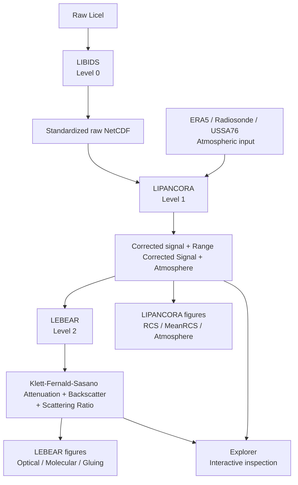

# MILGRAU 🌩️

**Multi-Indexed LALINET GeneRAlized and Unified algorithm**

MILGRAU is a Python processing suite for atmospheric elastic/Raman lidar data, developed around the long-term SPU-Lidar record operated by IPEN/USP in São Paulo, Brazil. It converts raw Licel acquisitions into traceable Level 0, Level 1 and elastic Level 2 scientific products while keeping instrument history, atmospheric state, retrieval assumptions, uncertainty semantics and provenance visible.


## Processing path


```mermaid
flowchart TD
    R[Raw Licel] --> L0[LIBIDS\nLevel 0]
    L0 --> N0[Standardized raw NetCDF]
    N0 --> L1[LIPANCORA\nLevel 1]
    M[ERA5 / Radiosonde / USSA76\n Atmospheric input] --> L1
    L1 --> N1[Corrected signal + Range Corrected Signal + Atmosphere]
    N1 --> L2[LEBEAR\nLevel 2]
    L2 --> N2[Klett-Fernald-Sasano \n Attenuation + Backscatter + Scattering Ratio]
    N1 --> F1[LIPANCORA figures\nRCS / MeanRCS / Atmosphere]
    N2 --> F2[LEBEAR figures\nOptical / Molecular / Gluing]
    N1 --> V[Explorer\nInteractive inspection]
    N2 --> V
```

| Stage | Command | Main product |
| --- | --- | --- |
| Level 0 | `milgrau-libids` | standardized raw acquisition NetCDF |
| Level 1 | `milgrau-lipancora` | corrected signal/RCS, uncertainty and canonical atmosphere |
| Level 1 figures | `milgrau-lipancora` | RCS quicklooks, MeanRCS and atmospheric comparison |
| Level 2 | `milgrau-lebear` | selected/glued signal, molecular fields and elastic aerosol optical products |
| Explorer | `milgrau-explorer` | interactive product inspection |

See [`docs/processing_levels.md`](docs/processing_levels.md) for the stable contract of each stage.

## Current Level 2 scientific baseline

The Level 2 uses **two-sided elastic Klett–Fernald–Sasano** retrieval for configured elastic wavelengths. It preserves the validated backward branch below the selected molecular reference and retrieves forward only while contiguous measured support and the Fernald numerics remain valid. Current method includes:

- one common support mask for signal means and their reported uncertainties;
- missing signal uncertainty is unsupported, never silently converted to zero Monte Carlo noise;
- molecular calculations use the complete pressure/temperature atmosphere materialized at Level 1;
- Rayleigh reference diagnostics plus backward/forward KFS validity and endpoints are explicit;
- aggregate optical uncertainty does not treat mixed lidar-ratio/reference nuisance terms as independent noise;
- elastic extinction is conditional on the assumed aerosol lidar ratio;
- unsupported optical bins remain `NaN`; the method does not pad or promise a fixed retrieval top.

The current product and uncertainty policy are documented in [`docs/level2_schema.md`](docs/level2_schema.md). The mapping from scientific claims to code, tests, product metadata and primary literature is in [`docs/scientific_traceability.md`](docs/scientific_traceability.md).

## Installation

MILGRAU requires **Python 3.12 or newer**.

```bash
git clone https://github.com/spulidar/milgrau.git
cd milgrau
git checkout session-refactor
python -m venv .venv
```

Activate the environment and install the package:

```bash
pip install .
```

For editable development/testing:

```bash
pip install -e ".[dev]"
```

ERA5 support is installed with the core package because it is the productive
Level 1 atmospheric backbone. Credentials are not stored in MILGRAU YAML or
NetCDF provenance; use the normal provider-supported `cdsapi` credential
mechanism.

Optional extras:

```bash
# Interactive Streamlit explorer
pip install -e ".[explorer]"

# Complete local development environment
pip install -e ".[dev,explorer]"
```

## Quick start

With `config.yaml` and `station.yaml` resolved for the project:

```bash
milgrau-libids
milgrau-lipancora
milgrau-lebear
```

If Level 1 already exists and only figures need to be generated or repaired:

```bash
milgrau-lipancora --figures-only -i spu_20250511-0012Z_20250511-0737Z
```

Without `--force`, only missing/outdated figures are rendered. Add
`--force` to regenerate every Level 1 figure. Re-running normal
`milgrau-lipancora` also checks/repairs figures when the scientific L1 is
already current.

Level 1 heatmaps use plot-only display decimation and chunked mean-profile
statistics to keep memory bounded on long sessions; the scientific NetCDF
remains full resolution.

MILGRAU identifies scientific acquisitions as **continuous sessions**, not civil-time
publication windows. The canonical session ID is:

`station_YYYYMMDD-HHMMZ_YYYYMMDD-HHMMZ`

For example:

`spu_20250511-0012Z_20250511-0737Z`

The timestamps are UTC and use minute precision in the identifier. Exact acquisition
times remain in the NetCDF metadata. A session may cross midnight or any former
six-hour site boundary without being split. A true acquisition gap or a change in station profile/calibration starts a
new session. Inside one session, MILGRAU stores geometric solar elevation,
classifies each profile as `day` or `night` using the configured threshold,
and assigns contiguous `segXX` scientific segments.

Products are grouped by the UTC month in which the session starts:

```text
02-processed_data/
  spu/
    2025/
      05/
        spu_20250511-0012Z_20250511-0737Z/
          spu_20250511-0012Z_20250511-0737Z_L0.nc
          spu_20250511-0012Z_20250511-0737Z_L1.nc
          spu_20250511-0012Z_20250511-0737Z_L2.nc
          spu_20250511-0012Z_20250511-0737Z_seg00_L0_scc.nc  # when SCC export applies
          figures/
```

The primary CLIs accept a canonical session ID, a station-local civil date, or an
explicit file/directory path. A date selects sessions that intersect that local day:

```bash
milgrau-libids -i spu_20250511-0012Z_20250511-0737Z --force
milgrau-lipancora -i 20250510
milgrau-lebear -i spu_20250511-0012Z_20250511-0737Z
milgrau-lebear -i spu_20250511-0012Z_20250511-0737Z --regime night
milgrau-lebear -i spu_20250511-0012Z_20250511-0737Z --segment seg01
```

The solar selectors are scientific subsets of the same session, not new session
identities. `--regime night` may include more than one disjoint night segment
if a long session contains them; `--segment seg01` selects exactly one
contiguous segment. Either selector may be intersected with
`--time-window-utc`.

LIPANCORA generates the canonical Level 1 figures automatically for the complete
scientific session. LEBEAR likewise maintains Level 2 figures beside the Level 2
product. Visualization is therefore a responsibility of the processing level that
owns the underlying scientific product, not a separate pipeline.

Explicit UTC subsetting remains available for derived Level 2 products:

```bash
milgrau-lebear -i spu_20250511-0012Z_20250511-0737Z --time-window-utc 01:00 03:00
milgrau-lebear -i spu_20250511-0012Z_20250511-0737Z --regime night --time-window-utc 01:00 03:00
```

Public-site windows such as 00–06, 06–12, 12–18 and 18–24 are publication views
and are intentionally not MILGRAU session identities.

Shell status is deliberately operational. Scientific QA belongs in the NetCDF
diagnostics rather than being compressed into an exit code.

## Configuration 

MILGRAU keeps responsibilities separate:

- **`config.yaml`** — processing/scientific recipe: how the run should be processed;
- **`station.yaml`** — observational reality: station/instrument history, calibration identity and station-derived information;

The exact ownership boundary and hash/provenance policy are documented in [`docs/configuration_ownership.md`](docs/configuration_ownership.md). The canonical code-owner inventory is in [`docs/code_inventory.md`](docs/code_inventory.md).

Published NetCDF provenance embeds the exact processing/station YAML snapshots. Level 2 also identifies exact upstream Level 1 bytes and the installed MILGRAU Python source content, so scientific input/code states can be distinguished without relying on machine-local paths.

## Documentation map

- [`docs/processing_levels.md`](docs/processing_levels.md) — stable Level 0/1/2 responsibilities and boundaries.
- [`docs/configuration_ownership.md`](docs/configuration_ownership.md) — `config.yaml` vs `station.yaml` vs Python ownership.
- [`docs/code_inventory.md`](docs/code_inventory.md) — canonical module/API ownership.
- [`docs/atmospheric_profiles.md`](docs/atmospheric_profiles.md) — radiosonde/ERA5/USSA76 atmosphere handling.
- [`docs/level2_schema.md`](docs/level2_schema.md) — current Level 2 NetCDF schema, support, uncertainty and provenance semantics.
- [`docs/scientific_traceability.md`](docs/scientific_traceability.md) — scientific traceability matrix and verified bibliography.
- [`.github/tracker.md`](.github/tracker.md) — scientific engineering roadmap and acceptance gates.


## Citation

If you use MILGRAU, cite the software using [`CITATION.cff`](CITATION.cff). The current citation metadata identifies MILGRAU version `2026.9` and Zenodo DOI `10.5281/zenodo.20330638`.


## License

MILGRAU is distributed under the MIT License; see [`LICENSE`](LICENSE).
