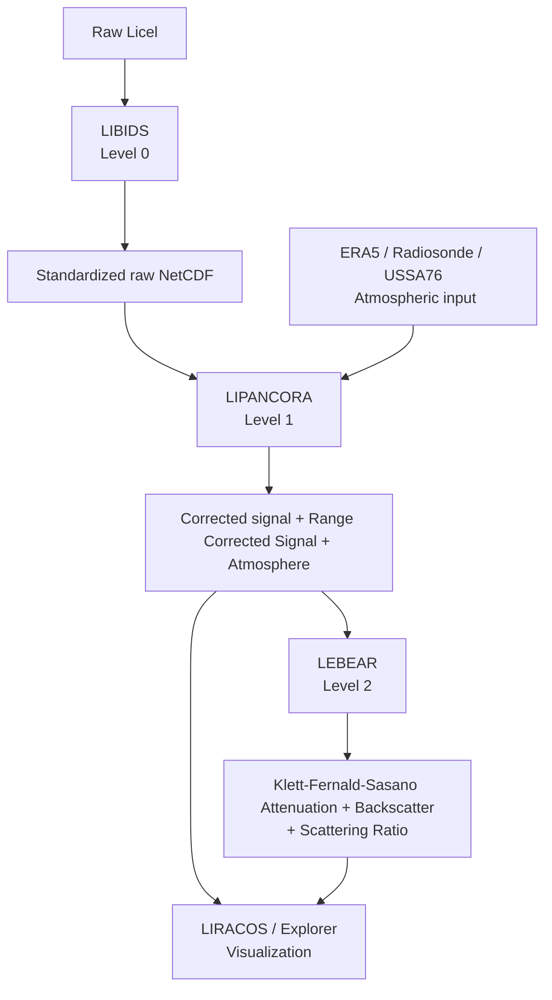

# MILGRAU 🌩️

**Multi-Indexed LALINET GeneRAlized and Unified algorithm**

MILGRAU is a Python processing suite for atmospheric elastic/Raman lidar data, developed around the long-term SPU-Lidar record operated by IPEN/USP in São Paulo, Brazil. It converts raw Licel acquisitions into traceable Level 0, Level 1 and elastic Level 2 scientific products while keeping instrument history, atmospheric state, retrieval assumptions, uncertainty semantics and provenance visible.


## Processing path


```mermaid
flowchart TD
    R[Raw Licel] --> L0[LIBIDS\nLevel 0]
    L0 --> N0[Standardized raw NetCDF]
    N0 --> L1[LIPANCORA\nLevel 1]
    M[ERA5 / Radiosonde / USSA76\n Atmospheric input] --> L1
    L1 --> N1[Corrected signal + Range Corrected Signal + Atmosphere]
    N1 --> L2[LEBEAR\nLevel 2]
    L2 --> N2[Klett-Fernald-Sasano \n Attenuation + Backscatter + Scattering Ratio]
    N1 --> V[LIRACOS / Explorer \n Visualization]
    N2 --> V[LIRACOS / Explorer \n Visualization]
```

| Stage | Command | Main product |
| --- | --- | --- |
| Level 0 | `milgrau-libids` | standardized raw acquisition NetCDF |
| Level 1 | `milgrau-lipancora` | corrected signal/RCS, uncertainty and canonical atmosphere |
| Visualization | `milgrau-liracos` | Level 1 quicklooks |
| Level 2 | `milgrau-lebear` | selected/glued signal, molecular fields and elastic aerosol optical products |
| Explorer | `milgrau-explorer` | interactive product inspection |

See [`docs/processing_levels.md`](docs/processing_levels.md) for the stable contract of each stage.

## Current Level 2 scientific baseline

The productive Level 2 path uses **two-sided elastic Klett–Fernald–Sasano** retrieval for configured elastic wavelengths. It preserves the validated backward branch below the selected molecular reference and retrieves forward only while contiguous measured support and the Fernald numerics remain valid. Current method hardening includes:

- one common support mask for signal means and their reported uncertainties;
- missing signal uncertainty is unsupported, never silently converted to zero Monte Carlo noise;
- molecular calculations use the complete pressure/temperature atmosphere materialized at Level 1;
- Rayleigh reference diagnostics plus backward/forward KFS validity and endpoints are explicit;
- aggregate optical uncertainty does not treat mixed lidar-ratio/reference nuisance terms as independent noise;
- elastic extinction is conditional on the assumed aerosol lidar ratio;
- unsupported optical bins remain `NaN`; the method does not pad or promise a fixed retrieval top.

The current product and uncertainty policy are documented in [`docs/level2_schema.md`](docs/level2_schema.md). The mapping from scientific claims to code, tests, product metadata and primary literature is in [`docs/scientific_traceability.md`](docs/scientific_traceability.md).

## Installation

MILGRAU requires **Python 3.12 or newer**.

```bash
git clone https://github.com/spulidar/milgrau.git
cd milgrau
git checkout new-architecture
python -m venv .venv
```

Activate the environment and install the package:

```bash
pip install .
```

For editable development/testing:

```bash
pip install -e ".[dev]"
```

Optional extras:

```bash
# ERA5 through the Copernicus Climate Data Store
pip install -e ".[era5]"

# Interactive Streamlit explorer
pip install -e ".[explorer]"

# Complete local development environment
pip install -e ".[dev,era5,explorer]"
```

ERA5 credentials are not stored in MILGRAU YAML or NetCDF provenance; use the normal provider-supported `cdsapi` credential mechanism.

## Quick start

With `config.yaml` and `station.yaml` resolved for the project:

```bash
milgrau-libids
milgrau-lipancora
milgrau-liracos
milgrau-lebear
```

The primary CLIs share the same flexible `-i/--input` selectors. A selector may be one canonical measurement ID, one local civil date, a date followed by one or more local six-hour period starts, or an explicit file/directory path:

```bash
milgrau-libids -i 20250509_spu_06 --force
milgrau-lipancora -i 20250509
milgrau-liracos -i 20250509 06 12
milgrau-lebear -i 20250509_spu_12
```

LIRACOS may zoom quicklooks and mean profiles to the interval that actually
contains measurements. Bounds are UTC and accept `HH:MM[:SS]` or complete
ISO-8601 timestamps; zoomed products receive a range suffix and do not
overwrite the full-period plots:

```bash
milgrau-liracos -i 20250509_spu_06 --time-window-utc 10:15 12:45
```

Canonical measurement IDs use `YYYYMMDD_station_HH`, where `HH` is the start of one of the fixed station-local periods `00`, `06`, `12`, or `18`. Products are grouped by station and local day, for example `processed/spu/2025/05/20250509/20250509_spu_06_L1.nc`.

LEBEAR can also process a restricted UTC interval without changing the original Level 1 product:

```bash
milgrau-lebear -i 20250509_spu_00 --time-window-utc 04:00 05:00
```

The resulting Level 2 filename carries the explicit UTC window tag, for example `20250509_spu_00_0400-0500Z_L2.nc`.

Shell status is deliberately operational. Scientific QA belongs in the NetCDF diagnostics rather than being compressed into an exit code.

## Configuration 

MILGRAU keeps responsibilities separate:

- **`config.yaml`** — processing/scientific recipe: how the run should be processed;
- **`station.yaml`** — observational reality: station/instrument history, calibration identity and station-derived information;

The exact ownership boundary and hash/provenance policy are documented in [`docs/configuration_ownership.md`](docs/configuration_ownership.md). The canonical code-owner inventory is in [`docs/code_inventory.md`](docs/code_inventory.md).

Published NetCDF provenance embeds the exact processing/station YAML snapshots. Level 2 also identifies exact upstream Level 1 bytes and the installed MILGRAU Python source content, so scientific input/code states can be distinguished without relying on machine-local paths.

## Documentation map

- [`docs/processing_levels.md`](docs/processing_levels.md) — stable Level 0/1/2 responsibilities and boundaries.
- [`docs/configuration_ownership.md`](docs/configuration_ownership.md) — `config.yaml` vs `station.yaml` vs Python ownership.
- [`docs/code_inventory.md`](docs/code_inventory.md) — canonical module/API ownership.
- [`docs/atmospheric_profiles.md`](docs/atmospheric_profiles.md) — radiosonde/ERA5/USSA76 atmosphere handling.
- [`docs/level2_schema.md`](docs/level2_schema.md) — current Level 2 NetCDF schema, support, uncertainty and provenance semantics.
- [`docs/scientific_traceability.md`](docs/scientific_traceability.md) — scientific traceability matrix and verified bibliography.
- [`.github/tracker.md`](.github/tracker.md) — scientific engineering roadmap and acceptance gates.


## Citation

If you use MILGRAU, cite the software using [`CITATION.cff`](CITATION.cff). The current citation metadata identifies MILGRAU version `2026.9` and Zenodo DOI `10.5281/zenodo.20330638`.


## License

MILGRAU is distributed under the MIT License; see [`LICENSE`](LICENSE).
